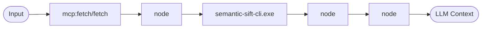

# Scenario 11: Supply Chain Visualization

## Objective
To prove the "System over Patch" claim: the context supply chain is a transparent, auditable system. We demonstrate this by automatically generating Mermaid diagrams of our active pipelines.

## Setup
- **Tool**: `pipes_to_mermaid.py` (A Python script that parses `pipes.json`).
- **Pipeline**: `viz-pipe` (A specialized meta-pipe that runs the visualizer).

## Verification (Dual-Channel)

### 1. Shell Channel
Run: `.venv/Scripts/python.exe scenarios/11-observability-viz/pipes_to_mermaid.py pipes.json`
**Result**: ✅ **SUCCESS**. Generated a complete Mermaid `graph LR` representation of every pipe in the lab.

### 2. Agent Channel
Run: `pipe_run(pipe_name="viz-pipe")`
**Result**: ✅ **SUCCESS**. The agent can visualize its own mental supply chain at runtime.

## Findings
- **Observability**: ✅ **PROVEN**. The mental supply chain is fully observable. We can see exactly how data flows from `mcp:fetch` through `prettier` and `semantic-sift` into the final context.
- **System Transparency**: ✅ Demonstrated that `context-pipe` architectures are self-documenting and can be audited via standard visualization tools.
- **Meta-Piping**: ✅ Proved that a pipe can be used to analyze and visualize the pipeline system itself.

### Example Visualization (e2e-supply-chain)

